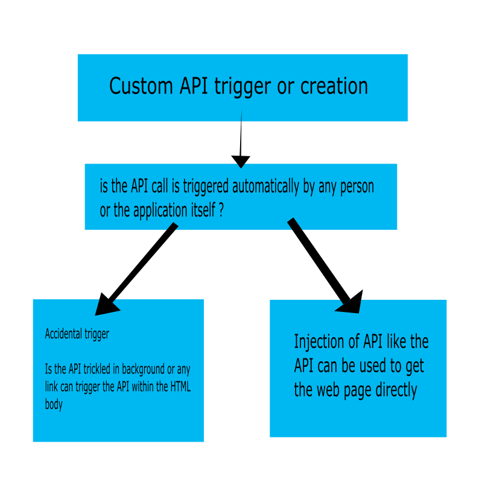

# APIBleeding

this the sample implementation of the api bleeding attack and a POC (proof of concept)

## Introduction

API Bleeding is a API injection attack that can be used perform the SQL operation using the API

this type of attack can also leak the technology used.

this type of attack is always a combination of api injection with path traversal attack or any other html header or request attack

sometimes even we can combine it with the client side attacks like XSS etc .....

### Breif on API attacks

there are many ways api attacks can be triggered.

1. API attack that performs read write operation without the authentication

2. injection of api in the request params 

3. MITM who modify the api calls

4. xss or other injections that cause api injection

5. direct modification of the url

## what is API Bleeding and How it works

this attack is possible when we are able to create a custom api call that can be creation a subdirectory in a web page

eg: if you are able to create a github page which triggers the github api without triggering the page itself

